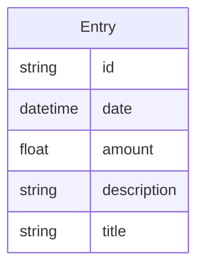
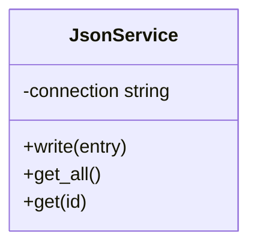
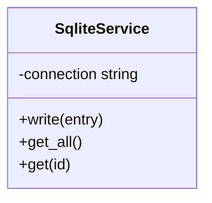
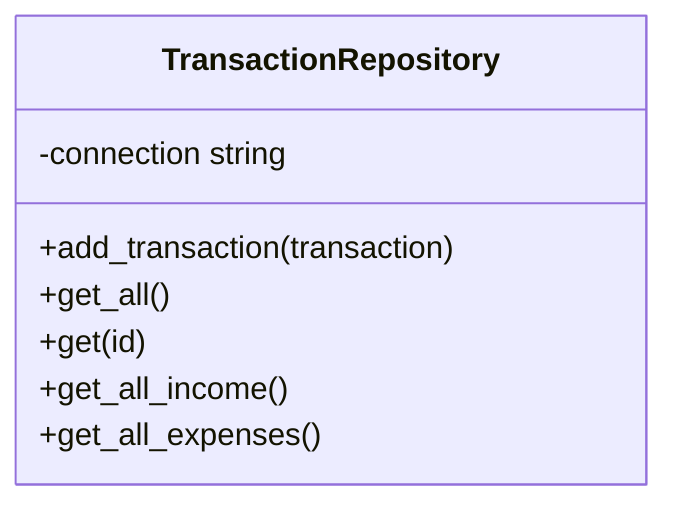
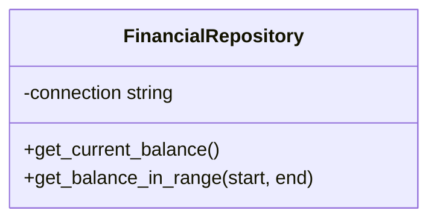

## Case Study
We need to create a simple finance tracking application that allows a user to track their daily income and spending. The user should be able to save the information that they enter to a local file so that the information can be presisted. 

### Key Requirements 
- Add income 
- Add expense 
- Save to file

### Additional Requirements
- View expenses 
- View Income
- View Current Balance 

## Data

### Entity Diagram 

--- 

### Class Diagram

----

## NOTES
Data generated using [Mockaroo](https://mockaroo.com/)